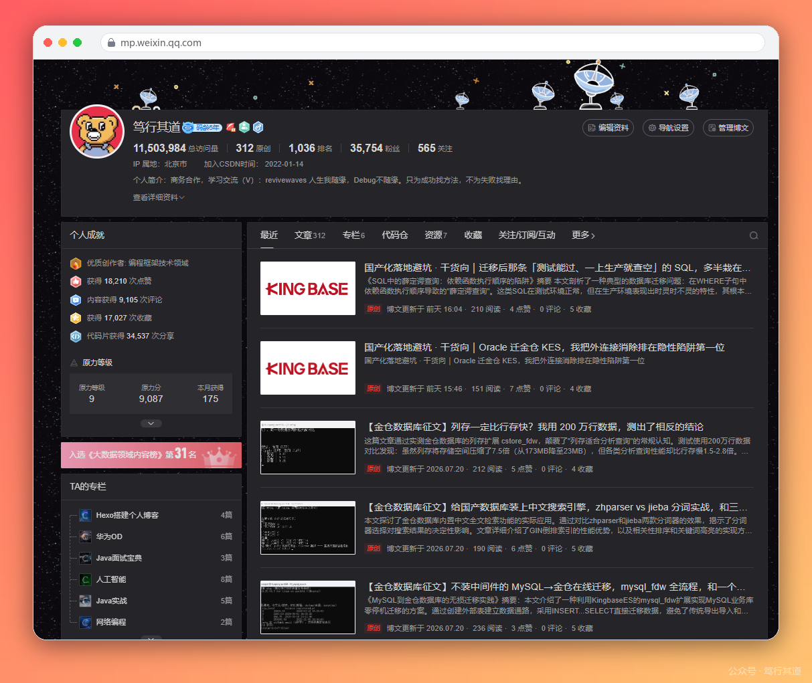
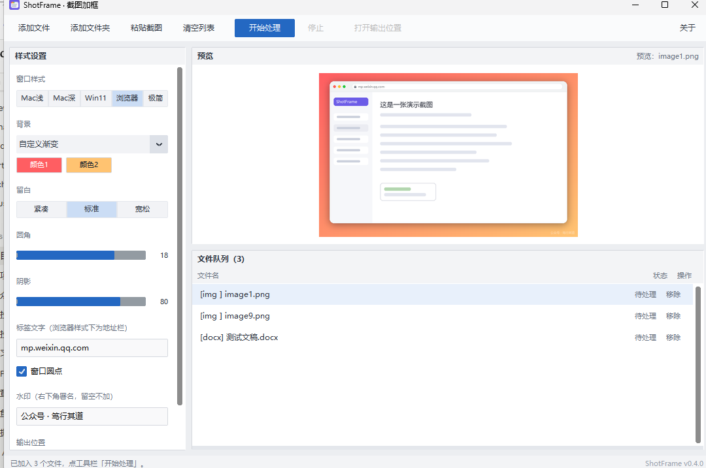
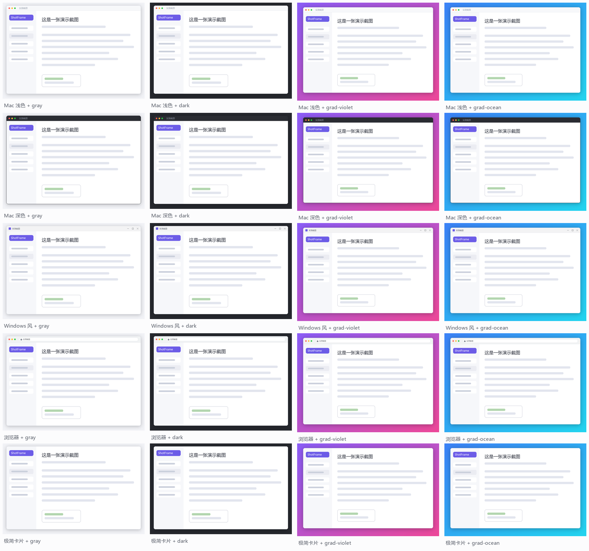

# ShotFrame · 截图加框

<p align="left">
  
  
  
  
  
  
</p>

写图文的人都懂：截图大多是白底黑字，贴进文章里和正文糊成一团，读者分不清哪是图、哪是文。

ShotFrame 给截图穿上「窗口卡片」——背景衬托、窗口栏、圆角阴影、水印署名，让每张截图一眼可辨。**离线运行，图片不出你的电脑。**



## 效果对比

同一张截图，处理前后（真实使用输出，浏览器框 + 落日渐变 + 右下角水印）：

| 处理前：白底截图，贴进文章就糊 | 处理后：一眼认出是截图 |
|---|---|
|  |  |

## 三十秒上手

1. 到 [Releases](../../releases) 下载 `ShotFrame-vX.X.X.exe`，双击打开（免安装）
2. 截图后按 **Ctrl+V**，或把 图片 / 文件夹 / docx / Markdown 拖进队列
3. 点「开始处理」，按 **Ctrl+C** 拿走结果，去公众号编辑器直接粘贴



## 样式

5 种窗口框 × 10 种预设背景 × 取色器自定义，再加留白三档、圆角 0-24、阴影 0-100、右下角水印，全部实时预览：



- **窗口框**：Mac 浅色 / Mac 深色 / Windows 风 / 浏览器（带地址栏，网址随便填）/ 极简卡片
- **背景**：6 种纯色 + 4 种渐变，或用取色器自定义纯色 / 双色渐变
- **样式预设**：整套样式存成命名方案（「公众号默认」「深色代码风」…），下拉一键切换

<details>
<summary>再看一张日常真实输出</summary>


</details>

## 为写作者设计的工作流

**单图快流**：截图 → Ctrl+V → 开始处理 → Ctrl+C → 去粘贴。全程不碰文件管理器，还可以勾选「处理完自动复制」再省一步。

**整篇文稿**：写完的稿子直接拖进来——

- **docx**：文档里所有插图统一加框，显示比例自动修正，排版纹丝不动
- **Markdown**：本地引用的图片全部加框并改写引用，网络图片自动跳过

都输出「原名-加框」新文件，**原稿和原图永远不动**。

**批量与可控**：文件队列逐项显示状态（完成 / 跳过 / 失败），可移除、可停止、带进度条；输出到同目录「加框」文件夹或自选目录；小于 200×100 的表情图标自动跳过；所有设置自动记忆。

## 命令行

```bash
ShotFrame.exe 截图.png --frame mac --bg gray --label "实测截图"
ShotFrame.exe 截图文件夹 --frame browser --bg grad-violet --recursive
ShotFrame.exe 我的稿子.docx --frame win11 --bg purple
ShotFrame.exe 我的文章.md --bg-color "#FF5E62,#FFC371" --watermark "公众号 · 笃行其道"
ShotFrame.exe --list-styles
```

exe 为无控制台打包，重度命令行用户建议直接跑源码。

## 从源码运行

```bash
git clone https://github.com/xiongwenhao112/ShotFrame.git
cd ShotFrame
pip install pillow python-docx tkinterdnd2 customtkinter
python main.py            # 图形界面
python test_matrix.py     # 回归测试（素材自动生成，克隆即可跑）
```

打包 exe：`pip install pyinstaller` 后运行 `build.bat`。

## 常见问题

**Windows Defender 报毒？** PyInstaller 单文件打包的常见误报，不是程序问题。介意请用源码运行或自行打包。

**文稿里有的图没处理？** 矢量图（emf/wmf/svg）、动图、小于 200×100 的图会跳过；Markdown 的网络图片和失效引用也会跳过，处理日志都会写明。

**图片会变形吗？** 不会。docx 里每张图的显示尺寸按新宽高比重算，回归测试有逐张比例校验。

## 原理与设计

一张卡片 = 背景画布（纯色/对角渐变）+ 投影 + 窗口（标题栏 + 截图本体）+ 描边，纯 Pillow 绘制，无外部素材。视觉语言参考 ray.so、screenshot.rocks、CleanShot X 与 Windows 11 Fluent。核心在 `shotframe/core.py`，加一种样式只需在 `FRAMES` / `BACKDROPS` 添一项再写一个小绘制函数；docx 与 Markdown 处理分别在 `docx_frame.py` / `md_frame.py`。

## License

[MIT](LICENSE)，作者 [笃行其道](https://github.com/xiongwenhao112)。这个工具诞生于一次公众号排版，README 里的效果图全部来自作者日常真实使用。如果它帮到了你，欢迎点个 star。
