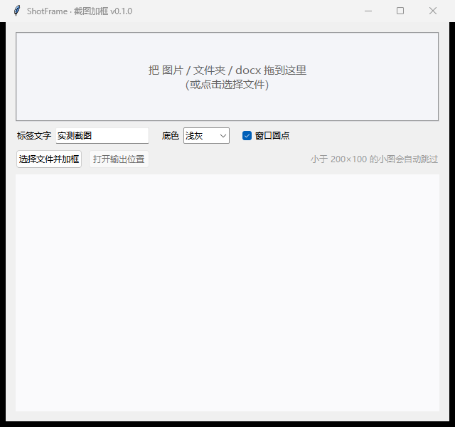
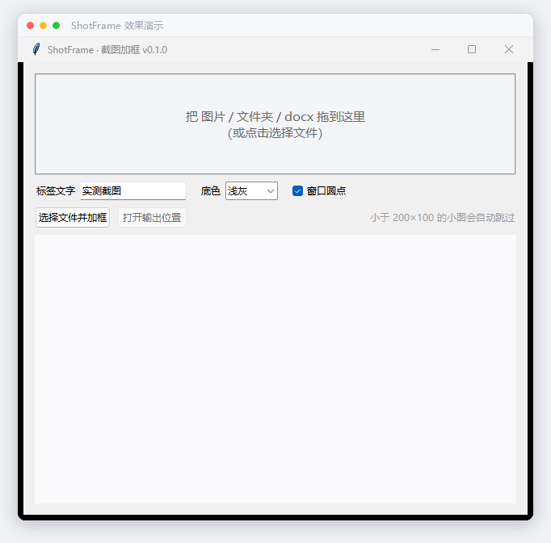

# ShotFrame · 截图加框

<p align="left">
  
  
  
  
  
  
</p>

一键给截图加上「窗口卡片」包装，让读者在图文里一眼认出这是截图，不再和正文糊在一起。

给公众号、知乎、掘金、博客写图文的作者设计。离线运行，图片不出你的电脑。


## 它解决什么问题

截图大多是白底黑字，贴进文章里和正文抢在一起，读者分不清哪是图哪是文。ShotFrame 给截图加上背景衬托、窗口栏、阴影描边，截图内容 100% 原样保留，只加包装。

## 样式

5 种窗口框 × 10 种预设背景 × 自定义颜色，自由组合：

- **窗口框**：Mac 浅色 / Mac 深色 / Windows 风 / 浏览器（带地址栏）/ 极简卡片
- **背景**：浅灰、浅紫、浅蓝、浅绿、纯白、深空 6 种纯色，紫粉、蓝青、落日、青碧 4 种渐变，以及**自定义纯色 / 自定义渐变**（取色器任选）
- **细节**：留白三档、圆角 0-24、阴影强度 0-100、右下角水印署名，全部可调


| 处理前 | 处理后 |
|---|---|
|  |  |

## 特点

- **文件队列**：图片、文件夹、docx、Markdown 拖入队列，确认样式后点「开始处理」统一执行；逐文件状态回写，可移除、可停止、带进度条
- **剪贴板进出**：截完图 Ctrl+V 直接入队（自动存到 图片/ShotFrame/），处理完「复制结果」或 Ctrl+C 把加框图放回剪贴板直接去粘贴；可选「处理完自动复制」，截图到贴进文章零文件操作；输入框聚焦时不抢快捷键
- **实时预览**：左边改样式右边立刻看效果，点击队列里的图片直接预览实图
- **docx / Markdown 整篇处理**：写完的稿子不用一张张抠图重贴。docx 拖进来，所有插图加框并自动修正显示比例；Markdown 拖进来，本地引用的图片全部加框并改写引用（网络图片自动跳过）。都输出「原名-加框」新文件，原稿不动
- **水印署名**：右下角可加「公众号 · 你的名字」小字，颜色随背景自动适配
- **输出可控**：默认输出到同目录「加框」文件夹，也可指定任意目录
- **离线 + 开源**：本地运行不上传，MIT 协议，设置自动记忆，核心就几百行

## 下载使用

到 [Releases](../../releases) 下载 `ShotFrame.exe`，双击打开，把图拖进去，或者截图后直接 Ctrl+V；处理完 Ctrl+C 拿走结果。

标签文字（浏览器样式下显示为地址栏网址）、窗口圆点均可配置，设置会自动记住。小于 200×100 的小图（表情、图标）自动跳过。

## 命令行用法

```bash
ShotFrame.exe 截图.png --frame mac --bg gray --label "实测截图"
ShotFrame.exe 截图文件夹 --frame browser --bg grad-violet --recursive
ShotFrame.exe 我的稿子.docx --frame win11 --bg purple
ShotFrame.exe 我的文章.md --frame mac --bg gray          # Markdown 同样整篇处理
ShotFrame.exe 图.png --bg-color "#6C5CE7,#EC4899" --pad loose --radius 18 \
    --shadow 80 --watermark "公众号 · 笃行其道"      # 自定义渐变+水印
ShotFrame.exe --list-styles        # 列出全部样式
```

注意，exe 是无控制台窗口的打包，命令行输出在部分终端里看不到；重度命令行用户建议直接跑源码 `python main.py ...`。

## 从源码运行

```bash
git clone https://github.com/xiongwenhao112/ShotFrame.git
cd ShotFrame
pip install pillow python-docx tkinterdnd2 customtkinter
python main.py            # 打开图形界面
python main.py 图.png     # 命令行模式
python test_matrix.py     # 回归测试（测试素材自动生成，无需外部文件）
python test_resize.py     # 窗口缩放稳定性回归
```

## 自己打包 exe

```bash
pip install pyinstaller
build.bat
```

## 常见问题

**Windows Defender 报毒？** PyInstaller 打包的单文件 exe 存在误报概率，这是打包方式的通病，不是程序有问题。介意的话请直接用源码运行，或自行打包。

**文稿里有的图没处理？** 矢量图（emf/wmf/svg）、动图（gif）、小于 200×100 的图会跳过；Markdown 里的网络图片（http/https）和找不到的引用也会跳过，处理日志里都会写明。

**图片会变形吗？** 不会。docx 模式下每张图的显示高度会按新宽高比重新计算，宽度保持不变，回归测试里有专门的比例一致性校验。

## 设计参考

窗口卡片的视觉语言参考了 ray.so（渐变背景）、screenshot.rocks / BrowserFrame（浏览器框）、CleanShot X / Xnapper（Mac 窗口）与 Windows 11 Fluent 风格，纯 Pillow 绘制，无外部素材依赖。

## 原理

一张卡片 = 背景画布（纯色/对角渐变）+ 投影 + 窗口（标题栏 + 截图本体）+ 描边。核心代码在 `shotframe/core.py`，窗口栏每种样式一个绘制函数，docx 处理在 `shotframe/docx_frame.py`，Markdown 处理在 `shotframe/md_frame.py`，加样式只需要在 `FRAMES`/`BACKDROPS` 里添一项再写一个小函数。

## License

[MIT](LICENSE)，作者 [笃行其道](https://github.com/xiongwenhao112)。这个工具诞生于一次公众号排版，如果它帮到了你，欢迎点个 star。
